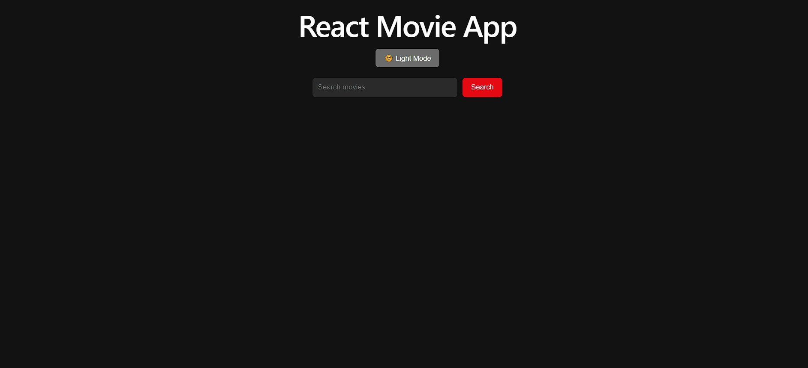
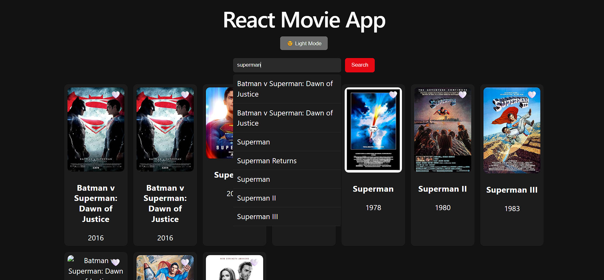
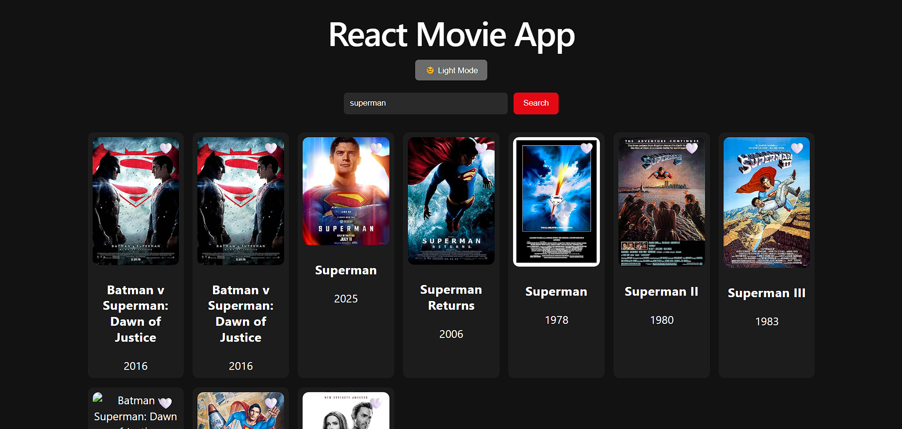
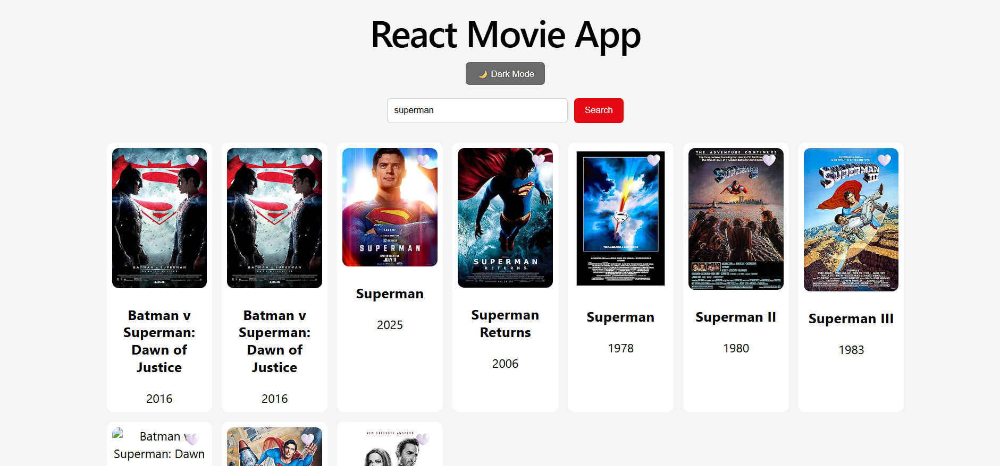
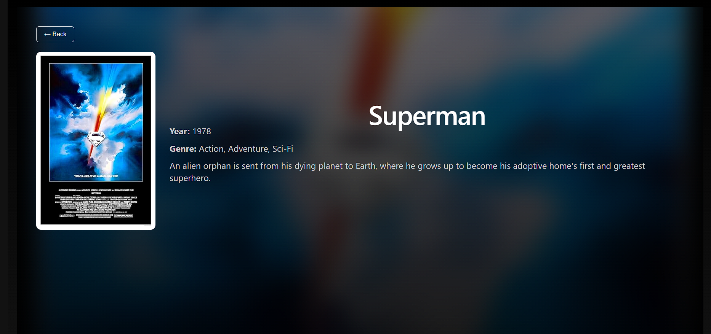

# 🎬 Movie Explorer

A modern movie search application built with **React**, featuring a Netflix-inspired user interface and real-time movie information powered by the **OMDb API**. Users can search for movies, view detailed information, and enjoy a responsive experience across desktop and mobile devices.

---

## ✨ Features

- 🔍 Search movies using the OMDb API
- ⚡ Autocomplete search suggestions
- 🎬 Dedicated movie details page
- 🌙 Light & Dark theme support
- 🎨 Netflix-inspired responsive user interface
- 📱 Mobile-friendly responsive design
- ✨ Smooth hover animations and interactive UI

---

## 🛠️ Tech Stack

- React.js
- React Router
- JavaScript (ES6+)
- CSS3
- Vite
- OMDb API

---

## 🌐 Live Demo

👉 **https://react-movie-app-zeta-three.vercel.app/**

---

## 📸 Screenshots

### 🏠 Home Page

<p align="center">
  
</p>

---

### 🔍 Movie Search

<p align="center">
  
</p>

---

### 🌙 Dark Theme

<p align="center">
  
</p>

---

### ☀️ Light Theme

<p align="center">
  
</p>

---

### 🎬 Movie Details


<p align="center">
  
</p>

---

## 📦 Installation

Clone the repository:

```bash
git clone https://github.com/Guruio/React-movie-app.git
```

Navigate to the project folder:

```bash
cd React-movie-app
```

Install dependencies:

```bash
npm install
```

Start the development server:

```bash
npm run dev
```

---

## 🔑 API Used

- **OMDb API** – Provides real-time movie information, posters, ratings, and details.

---

## 🔮 Future Improvements

- ❤️ Favorite Movies (Local Storage)
- ⏳ Loading Spinner
- 🚫 Improved Error Handling
- 🎭 Filter Movies by Genre
- 🎥 Movie Trailer Integration
- ⭐ Movie Ratings & Reviews

---

## 👨‍💻 Author

**Guru Prakash**

- 🌐 Portfolio: https://guruio.github.io/portfolio/
- 💼 LinkedIn: https://linkedin.com/in/guru-prakash-59833930a/
- 🐙 GitHub: https://github.com/Guruio
